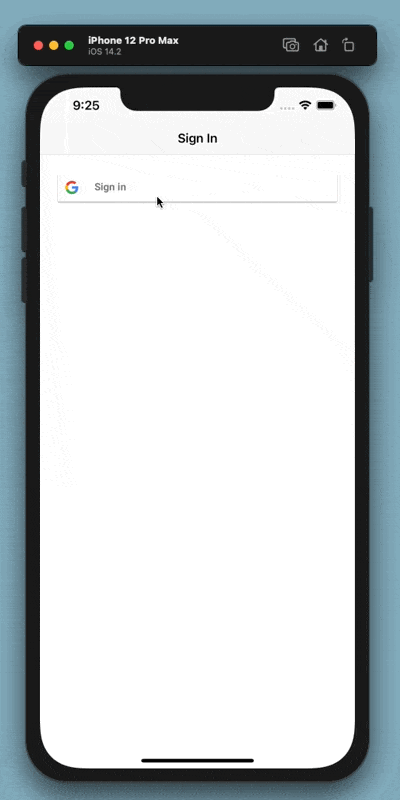

## iOS Firebase authentication example

This project aims to create a simple Google Sign in with some Alamofire API consumption.

- After user signed in, user data is being sent to an API
- Home screen shows the users signed in and registered in the API
- Logout behavior from home

